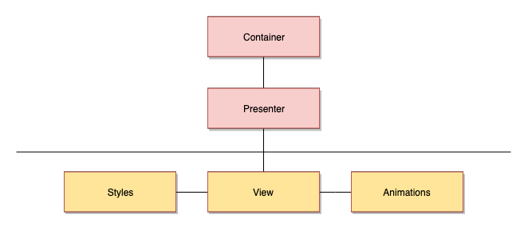

# Architecture

## 1. Component

In our projects we follow this architecture:


### 1.1 Smart group

Logic and data processing. Usual supported by developers.

#### 1.1.1 Container

Main question:\
What does business data component show and business logic
component use? 

Responsible for:
1. Getting and preparing data from store
2. Preparing actions
3. Including business logic

Filename:\
`<component>.container.tsx`

Exports `mapStateToProps` and / or `mapDispatchToProps` functions.

Example:
```
export const mapStateToProps = (state: StoreState): MappingStateProps => ({
    ownCards: getOwnCards(state),
    cardsForList: getCardsForList(state)
});
```

#### 1.1.2 Presenter

Stateful component.

Main question:\
What does component do?

Responsible for:
1. Storing and controlling UI state
2. Including all methods

Filename:\
`<component>.presenter.tsx`

Exports class name:\
`<Component>Presenter`

Example:
```
export class DomainListPresenter extends React.PureComponent<Props> {
    
    ...

    render(): React.ReactNode {
        const { ownCards, cardsForList } = this.props;
    
        return (
            <DomainListView
                items={ownCards}
                cardsForList={cardsForList}
                onCardUpdate={this.onCardUpdated}
                onCardAction={this.onCardAction}
            />
        );
    }

    private onDomainCreated(id: Guid): void {
        this.props.history.push(`${RouteType.DOMAINS}/${id}`);
    }

    private onCardUpdated(entity: CardEntity): void {
        const domainArgs = this.cardAppService.convertCardToDomainArgs(entity);
        this.domainActions.update(domainArgs);
    }

    ...
}
```

### 1.2 Stub group

Only UI view layers. Can be supported by designers.

#### 1.2.1 Styles 

Main question:\
How does component look?

Filename:\
`<component>.styles.tsx`

Example:
```
...

export const DomainListRoot = styled.div`
    position: relative;
    background: ${colors.background};
    height: 100%;
`;

export const CardListWrapper = styled(ContainerRoot)`
    height: ${styles.searchSectionPadding}%;
    overflow-y: auto;
`;

...
```

#### 1.2.2 View 

Main question:\
What does component show?

Responsible for:
1. Stateless component
2. Contains only makeup with handlers and interpolate data
 
Filename:\
`<component>.view.tsx`

Exports class name / functional component name:\
`<Component>View`

Example:
```
interface Props {
    items: CardEntity[];
    cardsForList: CardEntity[];
    onCardUpdate: (entity: CardEntity) => void;
    onCardAction: (action: CardContextMenuAction, entity: CardEntity) => void;
}

function DomainList({ items, cardsForList, onCardUpdate, onCardAction }: Props): React.ReactElement {
    return (
        <DomainListRoot>
            <CardListWrapper>
                <CardList
                    items={items}
                    onCardEdit={onCardUpdate}
                    onAction={onCardAction}
                />
            </CardListWrapper>
        </DomainListRoot>
    );
}

export const DomainListView = React.memo(DomainList);
```

#### 1.2.3 Animation

Main question:\
How does component change UI states?

Responsible for:
1. Includes animation states for some components.
2. As Framer Motion, as CSS

Filename:\
`<component>.animation.ts`

Example:
```
import { SwitchState } from '../switch.enum.ts';

const transition = { type: 'tween', duration: 1 };

export const animationStates = {
    container: {
        [SwitchState.OFF]: {
            background: '#bbbbbb',
            transition
        },
        [SwitchState.ON]: {
            background: '#0070df',
            transition
        }
    },
};
```

## 1.3 Index
 
Each component folder should contain `index` file with exported 
`<Component>`. If component contains container layer this file should
connect `mapStateToProps` and / or `mapDispatchToProps` with component.
In another case, just export `<Component>`.

Example with existing container layer:
```
import { connect } from 'react-redux';
import { DomainListPresenter } from './domain-list.presenter';
import { mapStateToProps } from './domain-list.container';

export const DomainList = connect(mapStateToProps)(DomainListPresenter);
```

Example with not existing container layer:
```
import { DomainListPresenter } from './domain-list.presenter';

export const DomainList = DomainListPresenter;
```
