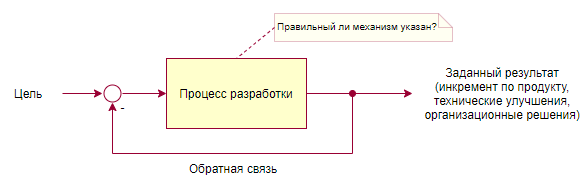
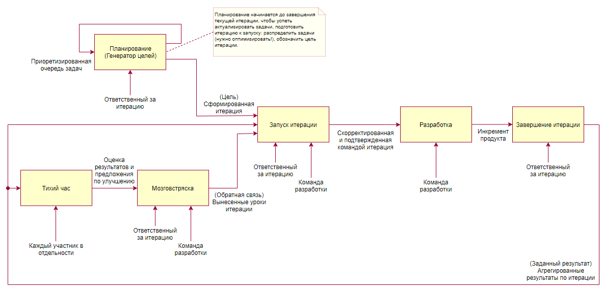

# Общие стандарты web-разработки

## 1. Файлы с исходным кодом

### 1.1. Правила именования

1. Имя файла должно быть в нижнем регистре.

```
    // Плохо
    Tag.ts

    // Хорошо
    tag.ts
```

2. Имя файла может содержать логические группы. Группы разделяются точкой (символ **.**). 

3. Если имя файла состоит из нескольких слов, то они разделяются дефисом (символ **-**).

```
    // Плохо
    progress_bar.ts

    // Хорошо
    progress-bar.ts
```

### 1.2. Кодировка

Файлы с исходным кодом должны использовать кодировку UTF-8.

### 1.3. Используемые специальные символы

#### 1.3.1. Пробельные

В качестве пробельного символа должен использоваться только символ пробела (0x20). 
Не должно быть использования других пробельных символов. Исключением является только 
символ завершения строки.

Таким образом, в качестве символа для определения **отступов** также используемся 
**символ пробела**. Использование **символа табуляции недопустимо**. Величина отступов 
и их оформление указаны в **п.3.2**.

#### 1.3.2. Использование управляющих последовательностей символов

Если управляющая последовательность имеет своё символьное представление, 
то следует использовать его, нежели использовать её числовое выражение:

```typescript
    // Плохо
    '\x0a', '\u000a', '\u{a}'

    // Хорошо
    '\'', '\"', '\\', '\b', '\f', '\n', '\r', '\t'
```

#### 1.3.3. Символы вне таблицы ASCII символов

Использовать управляющую последовательность unicode для представления символа, 
если он является непечатаемым символом. При использовании таких символов обозначать 
их через константу с однозначным и понятным названием, которое раскрывает смысл 
используемого символа.

```typescript
    // Плохо
    const currency = '\u20bd';
    // Плохо
    result = '\ufeff' + 'content';
    
    // Хорошо
    const currency = '₽';
    // Хорошо
    const MARK_OF_BYTE_ORDER = '\ufeff';
    result = MARK_OF_BYTE_ORDER + 'content'; 
```

## 2. Структура каталогов

Проект должен придерживаться следующей структуры:

```
    /src - Файлы, используемые приложением
        /app - Код приложения (модули, шаблоны, логика)
            /common - Общие для модулей приложения сущностями, перечислениями и т.д.
                /<concrete group>
                    *.ts
                    *.spec.ts
                    *.html
            /<module> - Модуль приложения. Например, экран мониторинга, экран планирования
                /<sub_module> - Часть экрана, которая более нигде не используется
                    *.ts
                    *.spec.ts
                    *.html           
            <app root files> - Корневой модуль, файл запуска приложения, корневой шаблон
        /assets - Дополнительные ресурсные файлы
            /favicon - Набор иконок, которые используются для отображения на вкладке браузера, в плитке приложений, ...
                <favicons>
            /fonts - Шрифты
                /<font> - Конкретный шрифт в разных разрешениях
                    *.ttf
                    *.woff
                    *.woff2
            ...
        /data - Заглушки на backend API
            *.tson
        /environments - Наборы констант приложения под разные среды
            environment.prod.ts
            environment.ts   
            ...
        ...
    package.tson - Файл, определяющий зависимости на сторонние для проекта библиотеки
    package-lock.tson - Файл, фиксирующий конкретные номера зависимостей
    README.md
    <другие корневые файлы конфигурации> - Например, karma.conf.ts, .gitignore, .gitlab-ci.yml, .npmrc, ...
            
```

Пример структуры:

```
    /src
        /app
            /common
                /components
                    /base
                        base.component.ts
                        base.component.spec.ts
                    /list
                        list.component.ts
                        list.component.spec.ts
                        ...
                    ...
                /entities
                    /tag
                        tag.ts
                        tag.spec.ts
                    /demand
                        demand.ts
                        demand.spec.ts
                    ...
                /enums
                    job_status_type.ts
                    ...
                /exceptions
                    /app_error
                        app_error.ts
                        app_error.spec.ts
                /services
                    /data_loader
                        data_loader.service.ts
                        data_loader.service.spec.ts
                    /job
                        job.service.ts
                        job.service.spec.ts
                    ...
                /utils
                    /logger
                        logger.ts
                        logger.spec.ts
                    ...
            /monitor
                monitor.component.ts
                monitor.component.spec.ts
                monitor.module.ts
            /plan
                ...
            ...
            app.module.ts
            app.routes.ts
        /assets
            /fonts
                /rubik
                    rubik_regular.ttf
                    rubik_regular.woff
                    rubik_regular.woff2
        /data
            zones.list.tson
            ...
        /environments
            environment.prod.ts
            environment.ts
    .editorconfig
    .eslint.ts
    .gitattributes
    .gitignore
    .gitlab_ci.yml
    .htmlhintrc
    .npmrc
    package.tson
    package_lock.tson
    webpack.config.ts
```

## 3. Форматирование

### 3.1. \[Автоматизировано: max-len\] Длина строк

Длина строк не должна превышать **120 символов**. Строка не может быть чуть-чуть длиннее 
указанной границы. Либо строка соответствует установленному лимиту, либо нет. 
Если строка превышает ограничение, нужно переносить её части в соответствии с 
правилами переноса выражений, указанными в разделе **3.5. Перенос выражений**.

**Исключения** составляют только следующие случаи:

* строки, которые не разорвать, например, длинный URL в JSDoc. С похожей ситуацией 
  можно столкнуться в json-файлах, которые также встречаются в проектах на javascript.

```typescript
    /**
     * ...
     * Поясняющий пример можно найти по ссылке:
     * http://www.theblaze.com/blog/2011/02/01/kansas-city-star-complains-about-the-lack-of-response-during-his-response-to-the-response-to-his-response-to-a-point-he-didnt-hear-and-doesnt-understand
     */
```

### 3.2. \[Автоматизировано: no-multiple-empty-lines\] Пробельные места

Файл должен завершаться строкой с содержимым, не должно быть пустой строки в конце файла.

## 4. Политики

### 4.1. Код не соответствует правилам руководства

a. Если вносятся существенные изменения в файл, который не соответствует принятым в настоящем 
руководстве правилам, то следует предварительно выполнить форматирование файла в соответствии 
с правилами.

b. Если вносятся незначительные изменения в файл, то привести к формату правил только тот 
участок кода, в который вносятся изменения.

c. Новый код должен соответствовать правилам руководства.

### 4.2. Сгенерированный код

Сгенерированный код, который используется в проекте, может не соответствовать правилам 
руководства. Однако имена идентификаторов, которые используются в проекте должны соответствовать 
правилам настоящего руководства. Это соответствие должно быть обеспечено либо на уровне 
генерируемого кода, либо на уровне приложения за счёт дополнительных преобразований.

### 4.3. Автоматизированные инспекции кода и фиксация изменений

Необходимо уделять внимание автоматизированным инспекция в IDE и инспекциям инструмента 
проверки кода `eslint` / `tslint`. Недопустимо выполнять фиксацию кода в репозитории,
если он не проходит проверку на соответствие принятому стандарту написания кода.  

## 5. Система контроля версий

### 5.1. Правила именования

#### 5.1.1. Ветка

Необходимо придерживаться следующего формата именования веток: 

`<тип задачи>/<номер задачи>-<краткое описание>`,

где

* тип задачи - новый функционал (feature), дефект (bug), предложение (proposal);
* номер задачи - номер задачи в системе учёта задач (gitlab), например 107. 
  Отсутствует для предложения (proposal);
* краткое описание - название задачи (допустим более краткий вариант) или краткое описание
  предложения (proposal) на английском языке (не транслитом) в kebab-case.

``` 
// Плохо
issue-241-dictionary-infobar-route-stops
feature/241
bug/301

// Хорошо
feature/241-dictionary-infobar-route-stops
bug/301-broken-infobar-dropdown
proposal/new-branch-type-for-proposals
```

#### 5.1.2. Сообщение к изменению

a. При фиксации изменения обязательно используется сообщение, описывающее изменение.

b. Сообщение должно описывать состав изменений и причину (назначение) изменения.

c. Сообщение должно иметь следующий формат:

```
<номер задачи> <модуль 1>[/<подмолуль>][, ..., <модуль N>[/<подмодуль>]]: <состав и семантика изменения 1>[, 
..., <состав и семантика изменения M>][; ...; <модуль K>[/<подмодуль>]: <состав и семантика изменения>]
```

Таким образом, самый простой вид сообщения:

```
<номер задачи> <модуль>: <состав и семантика изменения>
```

Разновидность наиболее насыщенного изменения:

```
<номер задачи> <модуль 1>/<подмолуль>, <модуль 2>/<подмодуль>: <состав и семантика изменения 1>, 
<состав и семантика изменения 2>]; <модуль 3>: <состав и семантика изменения>
```

где

  * `<номер задачи>` - корректный путь до задачи, который в идеальном случае обеспечивает
    связь изменения в репозитории и задачи на уровне ссылки. Например, `#17`, `CD-11`, 
    `inni/issues#104`;
  * `<модуль>` - название модуля, внутри которого вносится изменение. Модулем в данном случае
    называется любая директория в корне проекта, если эта директория вне директории `src` или
    любая директория внутри директории `src` (или директории, считающейся корнем исходного
    кода приложения). Если изменение касается проекта в общем, т.е. изменени структуры,
    изменение состава зависимостей, npm-скриптов и т.д., то в качестве модуля проставляется
    `common`. `common` также может относится к изменению в директории общего для модулей кода.
    Если изменение касается процесса непрерываной интеграции (continuous integration),
    то такое изменение отмечается: `ci`;
  * `<подмодуль>` - название подмодуля внутри модуля. Подмодулем считается директория 
    внутри директории модуля;
  * `<состав и семантика изменения>` - описание того, что и зачем было изменено.

Разделители:

  * `<номер задачи>` отделяется пробелом ` ` от остальной части сообщения;
  * `<модуль>` и `<подмодуль>` разделяются слешем `/`;
  * Группы `<модуль>/<подмодуль>` отделяются друг от друга запятой `,`;
  * `<модуль>/<подмодуль>` и `<состав и семантика изменения>` разделяются двоеточием `:`;
  * Группы `<модуль >: <состав и семантика изменения>` отделяются друг от друга точкой с запятой `;`;
  * Группы `<состав и семантика изменения>` отделяются друг от друга запятой `,`

В квадратных скобках `[]` указаны части сообщения, которые могут отсутствовать. 
Остальные составляющие являются обязательными.

Примеры:

```
// Структура проекта
data-collectors <root of project>
    /dev
        /db
            /data
            /model
            /queries
    /src
        /common
            /services
                /data
        /instrument
        /report
    package.json

// Плохо

// Отсутствует суть изменений
#287 common: review fixes
// Нет номера задачи, в указании модуля присутствует название проекта и указана излишняя вложенность
data-collectors/report/pasrer/historical: optimized parsing of the dom to get 2x speed of parsing

// Хорошо
inni/issues#104 common: added script to update dependencies to cure integrity check error
inni/issues#105 instrument: changed source of data from source1 to source2 to get more stable data stream
inni/issues#106 dev/db: changed type of the field `value` of report to store data from different sources;
report: implemented new service to get data from some new source of data.
inni/issues#107 common/services: added new service `report data service` to get report data from database
```

d. Не должно быть вложенности больше `<модуль>/<подмолуль>`, т.е. максимальная точность
указания изменения ограничивается вложенностью второго уровня. Если изменение касается
двух подмодулей одного модуля, то оба варианта записи сообщения об изменении являются
приемлемыми:

```
// Вариант 1. Сообщение разбито по подмодулям
<номер задачи> <модуль 1>/<подмолуль 1>: <состав и семантика изменения>; 
<модуль 1>/<подмодуль 2>: <состав и семантика изменения>

// Вариант 2. Сообщение сгруппировано по модулю
<номер задачи> <модуль 1>: <состав и семантика изменения с указанием, что оно сделано в подмодуле 1>,
<состав и семантика изменения с указанием, что оно сделано в подмодуле 2>; 
```

e. Не должно быть точки в конце сообщения.

f. Сообщение должно быть на английском языке, не должно быть транслита.

g. Каждая часть изменения, т.е. `<состав и семантика изменения>`, начинается с глагола
в прошедшем времени, т.е. описывает, что было сделано: `added ...`, `fixed ...`, ...

h. Исключение формата сообщения составляют автоматические фиксации изменений, 
выполняющиеся в процессе автоматизированной сборки и развёртывания, а также изменения
в результате слияния веток.

i. Формат сообщения при фиксации изменения в процессе автоматизированной сборки:

```
auto/ci: <текст сообщения>
```

Примеры:

```
auto/ci: set version 0.1.24
```

j. Формат сообщения при слиянии веток:

```
// Слияние ветки <название ветки> -> master
Merge branch '<название ветки>'

// Слияние ветки <название ветки 1> -> <название ветки 2>
Merge branch '<название ветки 1>' into <название ветки 2>
```

Примеры:

```
Merge branch 'dev'
Merge branch 'feature/101-automate-rules-of-object-formatting' into dev
```

k. Вместо номера задачи в редких случаях, когда требуется внести очень мелкое изменение,
под которое не имеет смысла создавать задачу (исправление опечатки, корректировка какой-то
случайной проблемы), может указываться слово `microfix`.

```
microfix common: added comment to skipped specs
```

## 6. Процесс внесения изменений

### 6.1. Внесение изменений

a. Предпочтительнее фиксировать небольшие и законченные изменения.

b. Вносимому изменению должна соответствовать задача, описывающая требуемые изменения.

c. Изменения по задаче должны выполняться в отдельной ветке, соответствующей задаче и
названной в соответствии с правилами именования веток 
[п. 5.1.1](https://github.com/eigen-space/codestyle/tree/dev/doc/common#511-ветка).

d. Основной (рабочей) веткой является ветка `dev`.

e. Релизной веткой, т.е. веткой, в которую подливаются изменения, когда они соответствуют
следующей версии приложения, является ветка `master`.

f. Необходимо изменения сопровождать фиксацией сути изменения в файле `CHANGELOG.md` в
корне проекта. [Ведите Changelog](https://keepachangelog.com/ru/1.0.0/)

g. Сообщения к изменениям должны соответствовать правилам оформления сообщений, указанным
в [п. 5.1.2](https://github.com/eigen-space/codestyle/tree/dev/doc/common#512-сообщение-к-изменению).

h. Небольшие изменения (исправление опечатки, корректировка какой-то случайной проблемы), 
которые помечаются как `microfix`, могут вноситься сразу в рабочую ветку `dev`. Если изменение 
вызывает сомнение в стабильности, оно должно быть выполнено либо через задачу, либо через 
запрос на вливание этого изменения, чтобы оно прошло обзор кода (ревью).

i. Задача должна быть переведена в состояние "в работе", когда над ней действительно начата
работа.

j. Допускается отправлять в репозиторий только "зелёные файлы", т.е. файлы, по которым 
пройдены все инспекции кода.

k. Перед отправкой изменений в репозиторий должны выполняться автоматизированный
статический анализ кода и тесты. Не допускается отправлять изменения в репозиторий
с отключенной проверкой кода и запуска тестов (pre-commit / pre-push hooks).

l. Добавленные изменения должны быть покрыты спецификациями (автоматизированными тестами).

### 6.2. Завершение работы над задачей

a. В файле `CHANGELOG.md` в корне проекта присутствует запись о сделанных изменениях.
[Ведите Changelog](https://keepachangelog.com/ru/1.0.0/)

b. Задача должна быть перведена в состояние "ревью".

c. Должно быть выполнено саморевью задачи, т.е. просмотр своих изменений перед тем, 
как предложить сделать это другим участникам команды. На этом шаге, как правило,
устраняются очевидные проблемы по стилю кода, лишним фрагментам кода, отладочной информации,
недостающим комментариям и оптимизационным моментам по реализации.

d. Должен быть создан запрос на влитие изменений (merge request / pull request) в 
рабочую ветку `dev`. Аналогом может выступать создание ревью в инструментах типа
Upsource на ветку с изменениями.

e. Должно быть выполенно ревью изменений участниками команды.

f. После того, как изменения приняты проверяющими, исполнитель должен подлить в свою
ветку ветку `dev`, если есть конфликты, и затем выполнить влитие изменений в ветку `dev`
с последующим удалением своей ветки.

g. Задача должна быть переведена в состояние следующее состояние задачи (как правило, 
это состояние "готово") после её влития в `dev`.

### 6.3. Ведение журнала изменений (changelog)

a. В корне проекта должен быть файл `CHANGELOG.md`, в котором фиксируется суть вносимых
изменений.

b. Правила ведения журнала изменений должны соответствовать, описанным на ресурсе:
[Ведите Changelog](https://keepachangelog.com/ru/1.0.0/)

c. Для каждого изменения в начале строки должна быть указана ссылка на задачу, 
к которой относятся изменения.

```
// Пример описанного изменения
- [`DXAPP-571`](https://smekalka.atlassian.net/browse/DXAPP-571) Added 
  [redux-logger](https://github.com/LogRocket/redux-logger) as redux middleware to get alternative to react native
  debugger that slows down app during debug
```

d. Для записей в журнале изменений применяются те же правила по ограничению на длину строки,
что и для других файлов.

e. Если запись многострочная, то все строки по отступу должны быть выровнены по начала первой.

f. Запись в логе изменений должна быть краткой, но ёмкой. Должно быть понятно, что и зачем
было изменено.

g. Изменения, которые относятся к текущей версии, которая ещё не выпущена, должны быть в
специальной секции `[Unreleased changes]` в начале файла. При релизе (выпуске) версии эти 
изменения помечаются конкретной версией релиза и датой его выпуска. Секция же 
`[Unreleased changes]` очищается и начинает принимать следующие изменения.

### 6.4. Обзор кода (ревью)

#### 6.4.1. Цели обзора кода

a. Распространение информации о новых изменениях в текущем и смежных проектах среди
участников команды, чтобы все участники в равной степени понимали код проектов.

b. Повышение качества кода проектов.
 
с. Наращивание навыков разработки у участников команды.

d. Повышение мотивации писать код лучше.

e. Проверка корректности внесённых изменений в плане соответствия сути задачи.

#### 6.4.2. Смысл каждой цели в деталях

a. Если проектов больше 5 и объём кода в каждом из их растёт, участники команды, переходя на 
незнакомый проект или модуль, будут тратить время на вопросы к коллегам и попытки разобраться 
в чужом коде. Код ревью решает эту проблему: изменения будут просматриваться шаг за шагом 
маленькими порциями информации, которые легко усвоить. В результате каждый участник будет 
хотя бы понимать, что и как уже реализовано.
[?] Также для решения этой проблемы необходимо использовать документацию.

b. Код пишется 1 раз, а читается много. Необходимо, чтобы код был очевидным и простым.

c. Более опытные участники команды, комментируя код, делятся опытом с менее опытными, 
тем самым повышая их уровень.

d. Когда автор осознаёт, что результат его работы будет кем-то проверяться, он стремится
получить больше положительных комментариев и меньше запросов на исправление кода.

#### 6.4.3. Процесс обзора кода

a. Ревью инициируется созданием запроса на влитие кода и уведомлением об этом
участников команды, которые должны просмотреть код.

b. При необходимости в процессе работы можно запрашивать ревью кода у других участников
команды, чтобы на более ранней стадии решить возникающие вопросы и сомнения, реалзовав
решение сразу более красиво и правильно.

c. В запросе на влитие должна содержаться информация о задаче, с которой связан этот запрос.
Должна присутствовать ссылка на задачу.

d. Участники, проверяющие код, добавляют комментарии к запросу на влитие изменений.

e. Комментарии отмечает выполненными автор изменений, код которого просматирвают.

f. После корректировки замечаний и реализации предложений должен запрашиваться
повторный обзор кода.

g. Все вопросы по ревью обсуждаются наибыстрейшим из возможных способов. Недопустимо
использовать такой способ коммуникации, при котором ответ затягивается, а соответственно
затягивается и ревью.

#### 6.4.4. Противоречия и споры в процессе обзора кода

a. Споры и затягивание обзора кода не допускаются.

b. Как только появляются неоднозначности или разногласий в стиле кода, создаётся предложение
по решению этого противоречия, которое отправляется на обсуждение другим участникам команды.
Обсуждение и принятие предложения идёт отдельным потоком независимо от процесса обзора кода
в соответствии с правилами по принятию новых предолжений.

c. Не допускается повторных обсуждений по поводу уже принятых правил в рамках ревью. 
Любые идеи и предложения выносятся отдельно. Обзор кода проходит в рамках
уже принятых правил написания кода. Это не исключает возможности договориться о новых
при хорошем уровне коммуникаций и взаимопонимания в команде. (см. пункт выше)

#### 6.4.5. Правила для участников, проверяющих код

a. Закрыв файл после проверки, вы тем самым полностью принимаете этот вариант так, как будто это 
написали вы. А так же вы уже несёте ответственность за уровень качества и работоспособности кода. 
Таким образом, после того, как вы увидели чей-то код - он стал уже вашим.

b. Если что-то правится быстро (5-10 секунд) и ошибка встречается впервые, проверяющий может 
поправить это самостоятельно. Это является предпочтительным вариантом. Если это имеет смысл,
то можно уведомить автора об этих изменениях, чтобы он получил дополнительный опыт и учитывал
его в дальнейшей работе.

#### 6.4.6. Состав участников обзора кода

a. Запрос на влитие изменений должен быть сделан на двух участников команды, которые
в состоянии понять смысл изменений и подтвердить их корректностью. Не может считаться
выполненным ревью, если проверяющий кристально чисто не может осознать суть внесенных
изменений. В этом случае для ревью должны привлекаться другие участники команды, которые
в силах это сделать. Не должны заливаться изменения, смысл которых неочевиден.

b. В случае отсутствия достаточного состава принимающих изменения участников команды
запрос на влитие должен отправляться на руководителя группы, который должен обладать
полным представлением о сути изменений.

c. [?] После завершения обзора кода обязательным составом проверяющих результаты обзора
кода должны быть просмотрены оставшимися участниками команды, чтобы достичь обозначенных
целей по обучению и погружению в проект. 
Ревью для всех, кто пишет код, вне зависимости от того, кому оно адресовано. Если Васе написали 
замечание или указали на ошибку, то все участники команды должны запомнить этот момент и не 
повторять его в будущем. 
Для этой цели может создаваться канал `#review` в мессенжере (например, slack'е), 
куда отсылаются все комментарии с ревью или ссылка на ревью.

Тут такие мысли: 
    
   1. Знакомство с добавляемым в проект функционалом преследует демо.
   2. Какие-то изменения по стилю написания кода, которые могли бы увидеть другие участники
      команды, должны быть оформлены в виде предложений и добавлены в правила, т.е.
      по сути такую цель преследовать не стоит.
   3. Участники команды могли бы увидеть какие-то интересные технические решения и подходы.
      Возможно, их также стоит вносить в общие правила как лучшие практики.

d. [?] В качестве варианта ревью, возможно, стоит рассмотреть вариант демонстрации кода
автором с пояснениями. Это может сократить время, необходимое участникам команды на
осмысление кода каждому в отдельности.

#### 6.4.7. Написание комментариев в процессе обзора кода

a. Критиковать код, а не автора. Помните, раз вы увидели этот код - то он уже тоже ваш.

b. Аргументировать принципами (S.O.L.I.D., CLEAN и т.д.), выдвигать предложения по улучшению,
а не просто высказаться, что всё плохо.

c. Искренне высказывать позитивные эмоции, если что-то в коде понравилось. 
Это повышает мотивацию и продуктивность участников команды. Нужно помнить, что обзор кода направлен
на повышение качества. Соответственно в процессе обзора кода важно отмечать и закреплять
положительные моменты в коде, поощрять новые и интересные идеи.

d. Не писать в побудительном наклонении:

```
    // Хорошо
    `Я бы исправил здесь A на Б`, `Давай исправим А на Б?`
    `Нам стоило бы в этом случае сделать так ...`
    
    // Плохо
    `Исправь А на Б`
```

#### 6.4.8. Отношение к комментариям в обзоре кода

a. Не оправдываться в комментариях: `А, да, точно, я затупил`, `Я невыспался` и т.д.

b. Не принимать на личный счёт. Все ошибаются. Не ошибается только тот, кто ничего не делает.
Нам же просто нужно учиться на своём и чужом опыте, стараясь с каждым разом выполнять
работу лучше и лучше.

c. Запомнить ситуацию, усвоить полученный опыт.

d. Если не согласны - обсудить. Не использовать агрессивно-защитные высказывания и 
пассивное игноирование. Держать в голове всегда цели обзора кода и команды в целом.

#### 6.4.9. Проверка стиля кода

a. У каждого участника должны быть настроены все автоматизированные средства для 
автоматической проверки и исправлений кода.

b. В результате необходимо стремиться к отсутствию комментариев, касающихся стиля кода.

#### 6.4.10. Приоритет обзора кода

a. Обзор кода не должен задерживать поток задач, соответственно должен быть приоритетным
как для просматривающего изменения, так и для автора изменений. Задача в состоянии "ревью"
имеет наивысший приоритет, если по какой-то причине явно не было принято другое решение
в виде исключения.

b. Идеальное время влития изменений равно нулю, т.е. сразу после подачи запроса на влитие.
Необходимо стремиться к этому времени. Недопустимо затягивать этот процесс. 
Участники команды должны стремиться максимально оперативно довести задачу до влития.

c. Запрос на влитие изменений не должен отправляться на участников команды, которые 
не могут своевременно выполнить обзор кода.

#### 6.4.11. Учёт при планировании

a. Время на ревью и исправления должно учитываться при планировании задач на итерацию.
 
b. [?] Должно учитываться время, которое необходимо всем участникам команды для просмотра
результатов ревью. 

### 6.5. Выпуск следующей версии приложения

Под выпуском (релизом) следующей версии приложения понимается срез текущего функционала
рабочей версии приложения. При этом рабочая ветка `dev` заливается в релизную ветку
`master`.

Порядок действий при релизе

1. dev -> master
2. tag v.x.x.x
3. dev v.x.x.x + 1

Схема с веткой pre-release, если проект - это библиотека и проставление версии не
может быть автоматическим. Хотя можно проставлять версию автоматически на основе
changelog: added, changed, removed

## 7. Итерация

### 7.1. Основная идея

a. Итерация процесса разработки есть один цикл постановки подцелей,
производства продукта, получения результата и обратной связи для
корректировки качества получаемого результата (сюда же включена и 
эффектвность, которая влияет на конечный результат).



b. Процесс итерации можно представить списком таких этапв 
(мероприятий):

* Планирование итерации
* Запуск итерации
* Разработка
    * Решение задач. Не является мероприятием, заполняет
      всё доступное время.
    * Обзор решения (Ревью)    
    * Внутрикомандное демо
* Закрытие итерации
* Тихий час
* Мозговстряска



c. Суммарная продолжительность общекомандных мероприятий: 9 ч 

### 7.2. Роли

* Ответственный за итерацию, выбирается по наиболее старшей позиции
в команде.

### 7.3. Планирование итерации

a. Продолжительность: 3 ч

b. Цель: включить в следующую итерацию наиболее приоритетные задачи
из бизнес, технических и организационных очередей задач.

c. Задачи:

* актуализировать состав и приоритет задач
* распределить задачи между участниками в команде

d. Участники:

* ответственный за итерацию

e. Примечание:

* нужно оптимизировать (слишком долго)
* все задачи должны быть связаны с целями
* задачи должны постоянно актуализироваться и по сути быть уже 
отсортированными по приоритету, привязанными к целям и готовыми
к взятию в работу

### 7.4. Запуск итерации (Установка микроцелей)

a. Продолжительность: 15 мин (подготовка) + 10 мин

b. Цель: сделать фокус на целях итерации.

* актуализировать следующую итерацию по результатам 
завершения текущей
* проговорить цели, сделать акцент на целях
* проговорить непонятные задачи

c. Участники:

* ответственный за итерацию
* команда

d. Требования к участникам:

* ответственный за итерацию должен подготовить план итерации
* участники команды должны просмотреть предварительный план
и сформулировать вопросы

### 7.5. Обзор решения (Ревью)

a. Продолжительность (ежедневно): 1 ч

b. Цель: обратная связь по решению задачи.

d. Участники:

* команда

e. Примечание:

* подробно обзор рассмотрен в [отдельной секции](#64---)

### 7.6. Внутрикомандное демо

a. Продолжительность (ежедневно): 15 мин (подготовка) + 10 мин

b. Цель: оценить процент достижения цели.

c. Задачи: 

* текущий срез с фокусом на достигнутый за день результат
* получение обратной связи
* знакомство с результатами работы других участников команды

d. Участники:

* ответственный за итерацию
* команда

e. Требования к участникам:

* участники команды должны подготовить к демо выжимку по 
достигнутым результатам за день

f. Выжимка по достигнутым результатам:

* название и ссылка на задачу
* процент завершения
* оценка попадания в срок и в оценку
* достигнутый результат, оценка соответствия требованиям 

g. Ход встречи:

* Каждому участнику даётся не более 2 мин на представление результата.
НЕ нужно рассказывать, КАК к нему пришел и что делал, нужно показать,
ЧТО сделал и дать оценку результата и приближения к цели.
* Секция вопросов участнику.
* Повторить, пока не закончатся участники.
* Количество участников должно быть не более 4.

### 7.7. Закрытие итерации (Фиксация результатов)

a. Продолжительность: 30 мин

b. Цель: фиксация результатов итерации.

c. Задачи:

* сформировать статистику по выполнению задач по каждому
участнику в отдельности и по команде в целом
* определить процент достижения целей на итерацию
* актуализировать карточки сотрудников

d. Участники:

* ответственный за итерацию

e. Примечание:

* в идеале должно выполняться автоматически

### 7.8. Тихий час

a. Продолжительность: 1 ч

b. Цель: личная оценка достижения целей.

c. Задачи:

* просмотреть результаты итерации
* обдумать их
* зафиксировать положительные и отрицательные моменты
* подготовить предложения по улучшению

d. Участники:

* команда (каждый участник в отдельности)

### 7.9. Встряска мозгов (Оценка результатов)

a. Продолжительность: 15 мин

b. Цель: оценка достижения целей

c. Задачи:

* обсудить итоги итерации
* оценить процент достижения цели
* сделать выводы

d. Участники:

* ответственный за итерацию
* команда

### 7.10. Отношение к оценке времени выполнения задачи

a. Если исполнитель задачи понимает, что задача не может быть выполнена за время,
которым она была оценена, то нужно, как можно раньше донести эту информацию до
руководителя группы. Если же о недостаточности времени становится известно либо
в момент, когда лимит времени достигнут или превышен, то возможностей для маневра
практически не остаётся.

b. Исходное (оценочное) время на задачу не изменяется, изменяется только время,
которое осталось на доработку задачи.

### 7.11. Отношение к сроку выполнения задачи

TODO

### 7.12. Создание задач

TODO: Процедура добавления задач с меткой `unverified`.

Категоризировать задачи по важности (признак, определяющий 
распределение задач при обзоре решения (ревью)).

## 8. Внесение предложений

### 8.1. Порядок внесения предложений

a. Чтобы подать предложение, необходимо описать его в ветке с названием 
`proposal/<краткое название предложения>` и сделать запрос на вливание в ветку `dev`. 

b. Запрос должен быть просмотрен заинтересованными в течение полного рабочего дня
от начала подачи запроса. Также должна быть дана обратная связь: либо запрос
должен быть подтвержден, либо выдвинуты предложения для его корректировки.

c. По истечении полного рабочего дня должно быть достигнуто конечное решение по
предложению: принято (исходное или скорректированное) или отклонено.

d. Решение о принятии предложения принимается большинством участвующих голосов.
Если количество голосов равно, то решение остаётся за руководителем группы.

e. Если кто-то не проявил интереса к предложению, т.е. не участвовал в его
просмотре и обсуждении, это не должно мешать предложению быть принятым.
Если никто не одобрил предложение в оговоренное время, оно считается принятым
и должно быть влито в ветку `dev`.

f. Обсуждение предложения может идти в специальном канале в мессенджере или
запросе на влитие. Если рассматривать вариант в отдельном канале чата, то
должно быть отправлено сообщение с запросом на влитие, к которому уже в
отдельном потоке оставляются комментарии.
   
### 8.2. Когда правила по стилю кода начинают работать?

a. Каждое новое предложение по стилю кода должно быть автоматизировано. 
Правило не работает, пока оно не автоматизировано.

b. Правило добавляется с пометкой `\[Не автоматизировано\]` в заголовке правила.
Например: `3.2.2. \[Не автоматизировано\] Правила именования для обработчков`.

c. Должна быть создана задача на автоматизацию правила.

### 8.3. Localization of proposals

a. A proposal should be written down on both languages: Russian and English.

b. When you suggest your proposal, you can use only Russian language to avoid
corrections in both versions. When the proposal is ready to merge, you should
translate it to English.

## 9. Правила именования

### 9.1. \[Не автоматизировано\] Общие правила для всех идентификаторов

a. Используются только буквы латинского алфавита `[a-zA-Z]`, цифры `[0-9]`. 

b. Необходимо давать максимально говорящие, понятные имена. Делать выбор 
   в пользу более длинного названия, нежели в пользу менее понятного. 
   В то же время необходимо, чтобы названия по возможности состояли из наименьшего 
   количества слов (в идеале из одного), и их смысл был ясен, исходя из контекста. 
   Идеальное название - короткое, лаконичное и в то же время полностью раскрывающее 
   назначение.

c. Не использовать аббревиатуры, которые не являются общепринятыми.

d. Не использовать сокращений, которые не являются общепринятыми.

e. Использовать слова `count` и `number of` для названия переменных, в которых 
   содержится некоторое количество. В случаях, когда может быть двусмысленность 
   при использовании `count`, отдавать предпочтение варианту с `number of`

```typescript
    // Плохо

    n // Неговорящее название
    nErr // Неочевидное сокращение
    pcReader // Аббревиатура, у которой может быть несколько значений
    cstmrId // Выброшены гласные буквы из слова
    kSecondsPerDay // Специфичные префиксы

    // Хорошо
        
    priceCountReader // Без аббревиатур
    numberOfErrors
    dnsConnectionCount    
```

h. Не использовать более двух идущих подряд существительных. Добавлять в этом случае 
   какие-то предлоги-связки, например `of`.

```typescript
    // Плохо
    isRunningCalculateCurrentDraft

    // Хорошо
    isRunningCalculationOfCurrentDraft
```

i. Не использовать в качестве названий слова являющиеся служебными для языка.

j. Имена переменных должны состоять из слов, имеющих определенное смысловое значение 
   в английском языке. Не допускается использовать транслитерацию.

k. Не следует использовать венгерскую нотацию, т.е. не нужно кодировать тип 
   в имени переменной.

```typescript
    // Плохо
    iTripNumber

    // Хорошо
    tripNumber
```

### 9.2. Используемые для именования слова и сочетания

| Слово | Парное | Назначение |
|--|--|--|
| enable | disable | Активация/деактивация какого-то элемента. В результате этого действия элемент (сущность) становится доступной (недоступной). |
| enabled | disabled | Элемент активен/неактивен, т.е. допускает или не допускает взаимодействие с ним. |
| checked | unchecked | Элемент отмечен/ не отмечен (выбран/не выбран). Наиболее соответствует ситуации, когда элемент выбирается в списке с флажками (checkbox'ами). |
| opened | - | Открыт/не открыт элемент. Например, этот признак может быть у модального окна, выпадающей части поля выбора, контекстного меню. |
| state | - | Используется для именования состояния элемента. |
| filter | - | Используется для именования фильтра. |
| factory | - | Фабрика каких-то объектов. |
