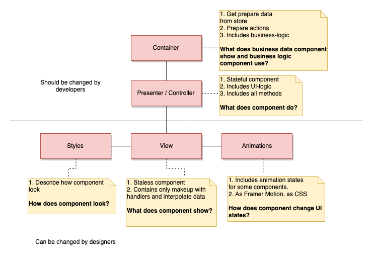

[en](./README.md)

# Архитектура компонентов

Наш проет следует архитектуре, представленной ниже:

Каждый файл должен быть назван как:
1. Для container: `<component>.tsx`
2. Для presenter: `<component>.presenter.tsx`
3. Для view: `<component>.view.tsx`

И каждый класс должен экспортироваться как:
1. Для container: `<Component>`
2. Для presenter: `<Component>Presenter`
3. Для view: `<Component>View`

Если компонент не содержит container слоя, то имя `<Component>` 
(без префиксов) должно быть присвоено последнему существующему слою. 
Например, компонент `Button` содержит только view, styles и animation. 
Мы экспортируем его, как `Button`. Если не существует только presenter'а, 
то container должен вернуть слой view.
